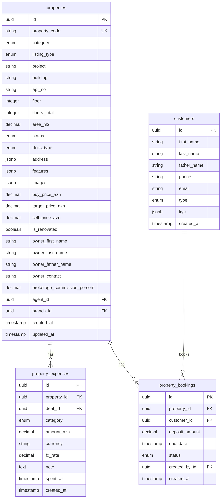
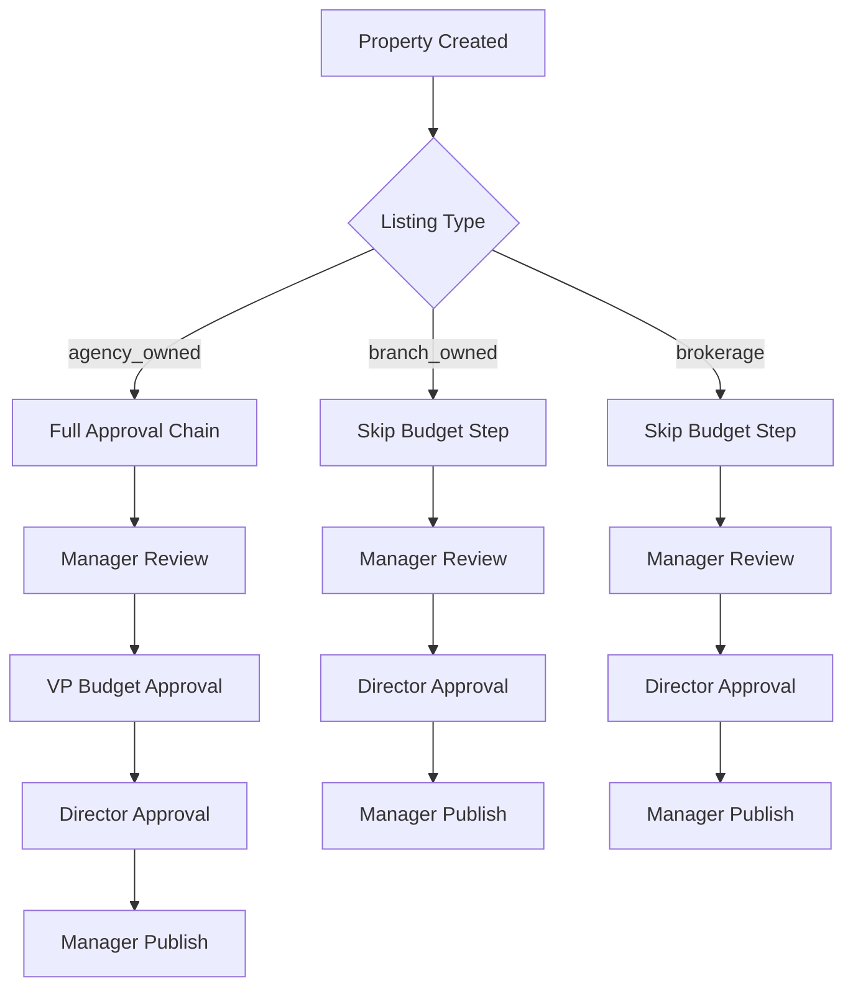
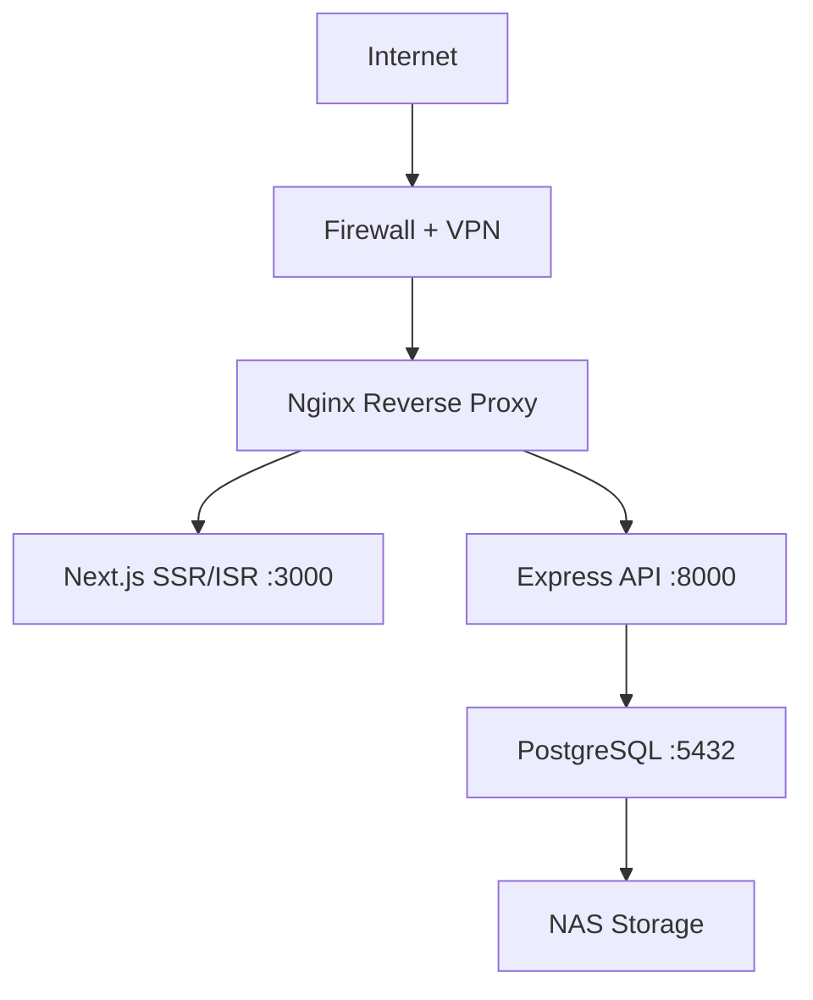

# Property Management Module - Implementation Design

## 1. Overview

This design document outlines the step-by-step implementation of the REA INVEST Property Management Module based on the comprehensive requirements and task specifications. The module serves as the core component of a real estate management system for medium-sized property agencies with branch structures.

## 2. Technology Stack & Dependencies

### 2.1 Backend Technologies
- **Runtime**: Node.js 18+ with Express.js framework
- **Database**: PostgreSQL 15 with Knex.js query builder/ORM
- **Authentication**: JWT tokens with bcrypt for password hashing
- **Validation**: Joi schemas for input validation
- **File Handling**: Multer + Sharp for image processing
- **Process Management**: PM2 or systemd services

### 2.2 Frontend Technologies
- **Framework**: Next.js 15.4.6 with App Router
- **UI Library**: React 19.1.0 with TypeScript
- **Styling**: Tailwind CSS v4 with shadcn/ui components
- **State Management**: React Context API and SWR for data fetching
- **Forms**: React Hook Form with Zod validation
- **Testing**: Jest with React Testing Library and Playwright for E2E

### 2.3 Infrastructure
- **Deployment**: Docker containerization with Kubernetes orchestration
- **Reverse Proxy**: Nginx
- **Monitoring**: Prometheus + Grafana (optional)
- **Storage**: NAS/Local encrypted storage for files

## 3. Database Schema Design

### 3.1 Core Tables Structure



### 3.2 Constraints and Indexes

**Critical Constraints:**
- Unique partial index: `(property_id) WHERE status='ACTIVE'` for bookings
- Check constraint: `listing_type IN ('agency_owned', 'branch_owned', 'brokerage')`
- Unique constraint: `property_code` across all properties

**Performance Indexes:**
- B-tree indexes: `(status, category, location, agent_id)`
- GIN indexes: `features`, `images`, `address` JSONB fields
- Composite indexes: `(branch_id, status, created_at)`

## 4. API Endpoint Architecture

### 4.1 Property CRUD Operations

```typescript
// Property Management Endpoints
GET    /api/properties              // List with filters and pagination
POST   /api/properties              // Create new property
GET    /api/properties/:id          // Get property details
PATCH  /api/properties/:id          // Update property
DELETE /api/properties/:id          // Soft delete

// Property-specific operations
POST   /api/properties/:id/expenses // Add expense
GET    /api/properties/:id/expenses // List expenses
POST   /api/properties/:id/bookings // Create booking
GET    /api/properties/:id/bookings // List bookings
```

### 4.2 Booking Management

```typescript
// Booking Operations
POST   /api/bookings                // Create new booking
GET    /api/bookings                // List user bookings
PATCH  /api/bookings/:id            // Update booking
POST   /api/bookings/:id/convert    // Convert to transaction (idempotent)
POST   /api/bookings/:id/cancel     // Cancel booking
```

### 4.3 Validation Rules Implementation

**Property Validation:**
- `listing_type=agency_owned`: `purchase_price` required, expenses recommended
- `listing_type=branch_owned`: `purchase_price` and at least 1 expense required
- `listing_type=brokerage`: owner fields and commission percentage required, purchase_price/expenses forbidden

**Booking Validation:**
- Only 1 ACTIVE booking per property (database constraint enforced)
- Booking expiry date must be in future
- Cancel/convert operations only allowed for ACTIVE bookings

## 5. Frontend Component Architecture

### 5.1 Page Structure and Rendering Strategy

```typescript
// Rendering Strategy by Route
/properties                 // ISR (60s revalidation) - public listings
/properties/create         // CSR - form-heavy interface  
/properties/[id]           // SSR - SEO optimization for sharing
/properties/[id]/edit      // CSR - dynamic form with real-time validation
/properties/[id]/booking   // CSR - interactive booking interface
```

### 5.2 Component Hierarchy

```
app/properties/
├── page.tsx                 // Property list with filters (ISR)
├── create/
│   └── page.tsx            // Property creation form (CSR)
├── [id]/
│   ├── page.tsx            // Property detail view (SSR)
│   ├── edit/
│   │   └── page.tsx        // Property edit form (CSR)
│   └── booking/
│       └── page.tsx        // Booking interface (CSR)

components/properties/
├── PropertyCard.tsx        // List item component
├── PropertyForm.tsx        // Create/edit form
├── PropertyDetails.tsx     // Detail view component
├── BookingForm.tsx         // Booking creation
├── ExpenseTracker.tsx      // Expense management
└── PropertyFilters.tsx     // Search and filter interface
```

### 5.3 Form Architecture

**Dynamic Form Logic:**
- Conditional field rendering based on `listing_type`
- Real-time validation with Zod schemas
- Auto-save functionality for draft mode
- File upload with progress indicators

```typescript
// Form Schema Example
const propertySchema = z.object({
  property_category: z.enum(['residential', 'commercial']),
  listing_type: z.enum(['agency_owned', 'branch_owned', 'brokerage']),
  // Conditional validation based on listing_type
}).refine((data) => {
  if (data.listing_type === 'brokerage') {
    return data.owner_first_name && data.owner_last_name;
  }
  return true;
}, {
  message: "Owner information required for brokerage properties"
});
```

## 6. Business Logic Implementation

### 6.1 Approval Workflow Engine



**Conditional Rules:**
- `agency_owned`: All approval steps apply
- `branch_owned`: VP budget step automatically skipped
- `brokerage`: VP budget step automatically skipped, no purchase price/expenses required

### 6.2 Booking Constraint Enforcement

**Database Level:**
- Partial unique index: `(property_id) WHERE status='ACTIVE'`
- Constraint violation returns 409 Conflict

**API Level:**
- Idempotent convert-to-transaction operation
- Status transitions: ACTIVE → CONVERTED/EXPIRED/CANCELLED

### 6.3 Commission Calculations

**Branch Sales:**
- REA INVEST: 2.5% of profit
- Branch: 2.5% of profit

**Brokerage Sales:**
- Custom percentage per property
- Formula: `sale_price * brokerage_percent / 100`

## 7. Security Architecture

### 7.1 RBAC Implementation

**Role Hierarchy:**
- Agent: Manage own properties, create bookings
- Manager: Oversee team properties, approve transactions
- Director: Full system access, final approvals
- VP: Budget approvals, financial oversight
- Accountant: Export access, financial reporting

**Permission Matrix:**
```typescript
const permissions = {
  agent: ['property:create', 'property:read:own', 'booking:create'],
  manager: ['property:read:all', 'property:approve', 'booking:manage'],
  director: ['*'], // Full access
  // ... other roles
};
```

### 7.2 Audit Trail System

**Comprehensive Logging:**
- All mutations logged with before/after state
- Actor identification and IP tracking
- 5+ year retention requirement
- Export capabilities for compliance

**Audit Schema:**
```typescript
interface AuditLog {
  id: string;
  timestamp: Date;
  actor: { id: string; role: string };
  entity: { type: string; id: string };
  action: 'CREATE' | 'UPDATE' | 'DELETE' | 'APPROVE';
  before: any;
  after: any;
  ip: string;
  userAgent: string;
  metadata: any;
}
```

### 7.3 Data Protection

**Encryption Standards:**
- TLS 1.2+ for data in transit
- Disk encryption for data at rest
- PII masking in logs and exports
- Secure file storage with access controls

## 8. Performance Optimization

### 8.1 Database Performance

**Query Optimization:**
- Proper indexing strategy (B-tree, GIN)
- Materialized views for reports
- Connection pooling
- Server-side pagination

**Performance Targets:**
- API latency P95 < 300ms
- Dashboard load P95 < 3s
- XLSX export ≤ 60s (async)

### 8.2 Frontend Performance

**Optimization Strategies:**
- ISR for semi-static content
- Code splitting and lazy loading
- Image optimization pipeline
- Virtual scrolling for large lists

**Caching Strategy:**
- HTTP caching headers
- SWR for client-side data fetching
- ISR revalidation intervals

## 9. File Management System

### 9.1 Upload Pipeline

**File Processing:**
- Chunked upload for large files
- Image compression and optimization
- Multiple format support (images, videos, documents)
- File type and size validation

**Storage Architecture:**
- NAS/Local encrypted storage
- Organized by property/deal/document type
- Backup and versioning strategies
- Access logging and security

### 9.2 File Organization

```
storage/
├── properties/
│   ├── {property-id}/
│   │   ├── images/
│   │   ├── videos/
│   │   └── documents/
├── deals/
│   └── {deal-id}/
│       └── contracts/
└── temp/
    └── uploads/
```

## 10. Testing Strategy

### 10.1 Test Pyramid

**Unit Tests (60%):**
- Business logic validation
- Form schemas and validators
- Utility functions
- API endpoint logic

**Integration Tests (30%):**
- Database operations
- API endpoint interactions
- File upload workflows
- Authentication flows

**E2E Tests (10%):**
- Complete user journeys
- Cross-browser compatibility
- Mobile responsiveness
- Performance validation

### 10.2 Critical Test Scenarios

**Booking System:**
- Unique active booking constraint
- Idempotent conversion operations
- Status transition validation

**Property Management:**
- Conditional validation by listing type
- Approval workflow execution
- File upload and processing

**Security Testing:**
- RBAC enforcement
- Input validation
- Authentication flows
- Audit trail verification

## 11. Deployment and DevOps

### 11.1 Deployment Architecture



### 11.2 Environment Configuration

**Development:**
```bash
# Local setup
cd frontend && npm run dev
cd backend && npm run dev
# Database migrations
npm run migrate && npm run seed
```

**Production:**
```bash
# Build process
npm run build
# Migration deployment
npm run migrate
# Service management
pm2 start ecosystem.config.js
```

### 11.3 Monitoring and Alerting

**Key Metrics:**
- Application performance (latency, throughput)
- Database performance (connection pool, query time)
- Business metrics (booking conversion, approval times)
- Security events (failed authentications, suspicious activity)

**Alert Conditions:**
- SLO breaches (P95 latency > 300ms)
- Database connection issues
- Failed booking conversions
- Audit trail gaps

## 12. Data Migration and Backup

### 12.1 Migration Strategy

**From Excel to Database:**
- Data validation and cleansing scripts
- Incremental migration approach
- Rollback procedures
- Data integrity verification

### 12.2 Backup and Recovery

**Backup Schedule:**
- Daily full database backups
- Hourly differential backups
- Transaction log backups every 15 minutes
- File storage snapshots

**Recovery Targets:**
- RPO (Recovery Point Objective): ≤ 24 hours
- RTO (Recovery Time Objective): ≤ 4 hours
- MTTR (Mean Time To Recovery): ≤ 2 hours

## 13. Implementation Roadmap

### 13.1 Phase 1: Foundation (P0) - 3-5 days
- Database schema implementation
- Core CRUD API endpoints
- Basic frontend structure
- Authentication and RBAC

### 13.2 Phase 2: Core Features (P1) - 5-7 days
- Property form implementation
- Booking system
- File management
- Search and filtering

### 13.3 Phase 3: Advanced Features (P2) - 3-5 days
- Approval workflow
- Expense tracking
- Analytics dashboard
- Performance optimization

### 13.4 Phase 4: Quality Assurance (P1) - 2-3 days
- Comprehensive testing
- Security hardening
- Performance tuning
- Documentation completion

### 13.5 Phase 5: Production Readiness (P2) - 1-2 days
- Deployment preparation
- Monitoring setup
- Backup verification
- User training materials

## 14. Risk Assessment and Mitigation

### 14.1 Technical Risks

**Database Performance:**
- Risk: Large dataset performance degradation
- Mitigation: Proper indexing, query optimization, pagination

**File Upload:**
- Risk: Large file uploads causing server issues
- Mitigation: Chunked upload, file size limits, async processing

**Concurrent Booking:**
- Risk: Race conditions in booking creation
- Mitigation: Database constraints, idempotent operations

### 14.2 Business Risks

**Data Migration:**
- Risk: Data loss during Excel migration
- Mitigation: Comprehensive backups, validation scripts

**User Adoption:**
- Risk: Resistance to new system
- Mitigation: Training programs, gradual rollout

**Compliance:**
- Risk: Audit requirement failures
- Mitigation: Comprehensive audit logging, retention policies

## 15. Success Metrics and KPIs

### 15.1 Technical Metrics
- API response time P95 < 300ms
- Page load time P95 < 3s
- Test coverage ≥ 80%
- Zero critical security vulnerabilities
- 99.9% booking uniqueness constraint enforcement

### 15.2 Business Metrics
- Property creation time < 5 minutes average
- Booking conversion rate tracking
- File upload success rate > 99%
- User error rate < 1%
- Monthly reporting preparation time reduction by 80%

### 15.3 Quality Metrics
- Code review coverage 100%
- Documentation completeness 100%
- User acceptance test pass rate > 95%
- Performance benchmark achievement 100%
- Security audit compliance 100%

This design document serves as the comprehensive blueprint for implementing the REA INVEST Property Management Module, ensuring all technical requirements, business rules, and quality standards are met according to the specified tasks and timeline.